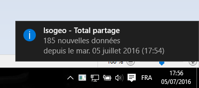
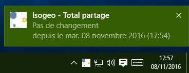
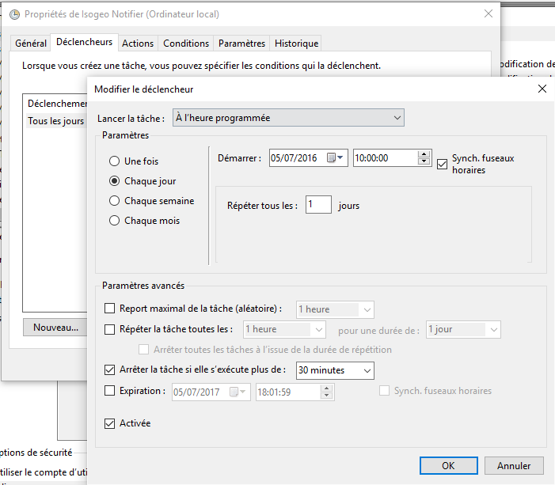
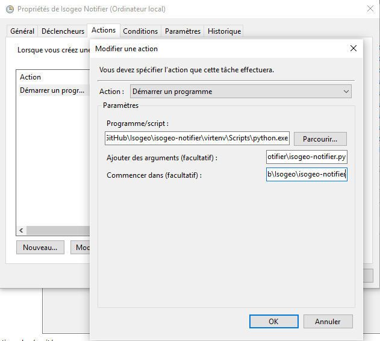

Isogeo Windows 10 Notifier
======

Script to receive daily notifications about the state and evolutions of an Isogeo share.
Must be combined with a scheduled task.

It's a POC to demonstrate faisability.

# Usage & render

Install and configure the scheduled task.
Then, you'll receive notifications like this:

When the amount of data shared has raised since last execution:



When the amount of data shared has reduced since last execution:


When the amount of data shared has not changed since last execution:



## Scheduled task

### Trigger

It's all on you. For example, to get a daily notification:



### Action

If you have installed outside a Python virtual environment, it's pretty easy.
If you have followed the install recomendations here is the help:

Program/script:
```
{absolute_path_to_the_folder}\virtenv\Scripts\python.exe
```

Arguments:
```
{absolute_path_to_the_folder}\isogeo-notifier.py
```

Launch in :
```
{absolute_path_to_the_folder}\
```

Example :



## Requirements

* Windows Operating System
* Internet connection
* rights to write on the output folder
* Python 2.7.9+ installed and added to the environment path
* Python SetupTools, Pip and virtualenv installed (see: [get setuptools and pip on Windows](http://docs.python-guide.org/en/latest/starting/install/win/#setuptools-pip))
* [Microsoft Visual C++ Compiler for Python 2.7](https://www.microsoft.com/en-us/download/details.aspx?id=44266)
* software able to read output files (*.docx, *.xlsx)
* an Isogeo account (admin or 3rd party developer)

## Quick installation and launch

1. Clone or download this repository ;
2. Open a command prompt in the folder and launch `pip install -r requirements.txt`. If you are on a shared machine with various tools related to Python, it's higly recomended to use a virtual environment. See: Python Virtualenvs on Windows and a [Powershell wrapper](https://bitbucket.org/guillermooo/virtualenvwrapper-powershell/) ;
3. Edit the *isogeo_params.ini* file and custom it with your informations. At less, you have to set *app_id* and *app_secret* with your own values. If you are behind a proxy, you should set the parameters too. ;
4. Set the scheduled task


## Detailed deployment

1. Download and install the last Python 2.7.x version (64bits version is recomended except if you use Python with incompatibilty like arcpy): https://www.python.org/downloads/windows ;
2. Add Python to the environment path, with the System Advanced Settings or with *powershell* typing `[Environment]::SetEnvironmentVariable("Path", "$env:Path;C:\Python27\;C:\Python27\Scripts\", "User")` ;
3. Download [get_pip.py](https://bootstrap.pypa.io/get-pip.py) and execute it from a *powershell* prompt as administrator: `python get_pip.py` ;
4. Download the repository, open an **admin** *powershell* inside and execute: `pip install virtualenv` ;
5. Execute: `set-executionpolicy RemoteSigned` to allow powershell advanced scripts. ;
6. Create the environment: `virtualenv virtenv --no-site-packages` ;
7. Activate it: `.\virtenv\Scripts\activate.ps1`. Your prompt should have changed. ;
8. Get the dependencies, choosing between 32/64 bits versions: `pip install -r requirements_32bits.txt` or `pip install -r requirements_64bits.txt` ;

## Support

This application is not part of Isogeo license contract and won't be supported or maintained as well. If you need help, send a mail to <projets+notifier@isogeo.fr>
