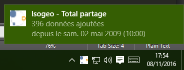
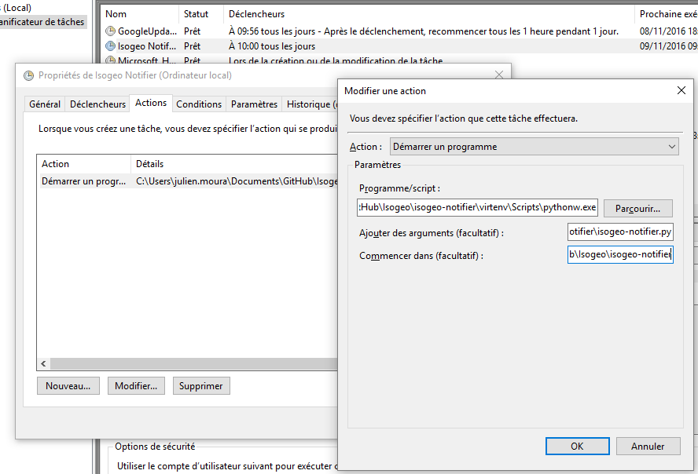

Isogeo Windows 10 Notifier
======

Script to receive daily notifications about the state and evolutions of an Isogeo share.
Must be combined with a scheduled task.

It's a **POC** to demonstrate faisability.

# Usage & render

Install and configure the scheduled task.
Then, you'll receive notifications like this:

When the amount of data shared has raised since last execution:



When the amount of data shared has reduced since last execution:


When the amount of data shared has not changed since last execution:


# Scheduled task

## Trigger

It's all on you. For example, to get a daily notification:


## Action

If you have installed outside a Python virtual environment, it's pretty easy.
If you have followed the install recomendations here is the help:

Program/script:
```
{absolute_path_to_the_folder}\virtenv\Scripts\pythonw.exe
```

Arguments:
```
{absolute_path_to_the_folder}\isogeo-notifier.py
```

Launch in :
```
{absolute_path_to_the_folder}\
```

Example :


______

# INSTALLATION

## Requirements

* Windows Operating System 10 (maybe should works on previous versions)
* Internet connection
* rights to write on the folder
* [Python 2.7.9+](https://www.python.org/downloads/windows) installed and added to the environment path
* [Microsoft Visual C++ Compiler for Python 2.7](https://www.microsoft.com/en-us/download/details.aspx?id=44266)
* Python SetupTools, Pip and virtualenv installed (see: [get setuptools and pip on Windows](http://docs.python-guide.org/en/latest/starting/install/win/#setuptools-pip))
* [Python Win32 API](https://sourceforge.net/projects/pywin32/files/pywin32/)
* Python requirements according your architecture (see requirements.txt files)
* an Isogeo account (admin or 3rd party developer) and API keys (contact us to get some)

## Installation and launch

**Once all requirements OK**

1. Clone or download this repository ;
2. Open a command prompt in the folder and launch `pip install -r requirements.txt`. If you are on a shared machine with various tools related to Python, it's higly recomended to use a virtual environment. See: Python Virtualenvs on Windows and a [Powershell wrapper](https://bitbucket.org/guillermooo/virtualenvwrapper-powershell/) ;
3. Edit the *isogeo_params.ini* file and custom it with your informations. At less, you have to set *app_id* and *app_secret* with your own values. If you are behind a proxy, you should set the parameters too. ;
4. Set the scheduled task (see above)

## Detailed deployment

1. Install the last [Python 2.7.x version](https://www.python.org/downloads/windows) (64 bits version is recomended except if you use Python with incompatibilty like arcpy) ;
2. Add Python to the environment path, with the System Advanced Settings or with *powershell* typing:

    ```powershell
    [Environment]::SetEnvironmentVariable("Path", "$env:Path;C:\Python27\;C:\Python27\Scripts\", "User")
    ```

3. Download [get_pip.py](https://bootstrap.pypa.io/get-pip.py) and execute it from a *powershell* prompt as administrator:

    ```powershell
    python get_pip.py
    ```

4. Install [Python Win32 API](https://sourceforge.net/projects/pywin32/files/pywin32/) with the adapted executable (32 or amd64 bits ending with *py2.7.exe*). Then open *powershell* as **administrator** and execute:

    ```powershell
    python.exe C:\Python27\Scripts\pywin32_postinstall.py -install
    ```

5. [Download](https://github.com/Guts/isogeo-notifier/archive/master.zip), extract the repository then and execute (adapting with your own path):

    ```powershell
    PS C:\Users\%USERNAME%\{path_to_git_repositories}\isogeo-notifier> pip install virtualenv
    ```

5. Execute and answer *Y* to allow powershell advanced scripts:

    ```powershell
    set-executionpolicy RemoteSigned
    ```

6. Create the environment then activate it:

    ```powershell
    virtualenv virtenv --no-site-packages
    .\virtenv\Scripts\activate.ps1
    ```
  
  Your prompt should have changed.

8. Get the dependencies, choosing between 32/64 bits versions:

  * `pip install -r requirements_32bits.txt`
  * or `pip install -r requirements_64bits.txt`

Everything is now set to work fine.

# Support

This application is not part of Isogeo license contract and won't be supported or maintained as well. If you need help, send a mail to <projets+notifier@isogeo.fr>.
